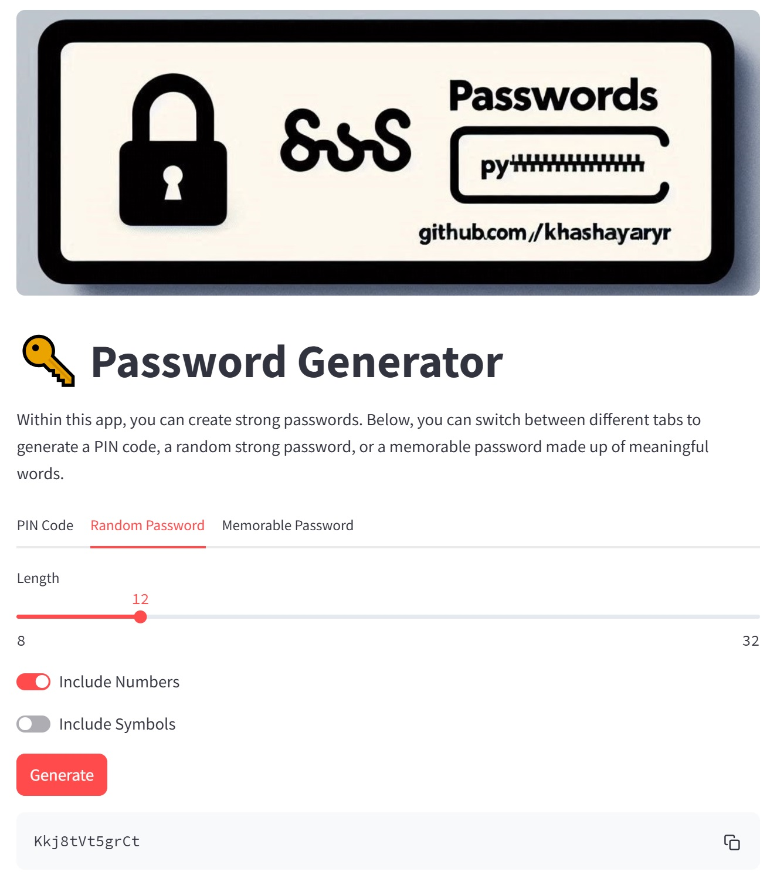

# Password Generator

## Overview
Within this app, you can create strong passwords.
By running this code, you will have a straightforward UI that allows you to generate either a PIN code, a random password, or a memorable password by defining some inputs.

<div align="center">
    
</div>


## How It Works
The password generator uses the Python random module to create passwords according to user preferences. The generator is split into three classes, each representing a distinct type of password generation:

1. `PinPassword` creates a PIN code of a specified length.
2. `RandomPassword` generates a completely random password of a specified length, optionally including numbers and symbols.
3. `MemorablePassword` generates a password consisting of a specific number of randomly chosen words from a set of commonly used English words. It can optionally separate the words with a separator and use capitalised words.

This password generator will be presented through a simple graphical interface using Streamlit, a powerful tool that transforms scripts into shareable web apps in minutes, all in pure Python and without requiring front-end experience.

## How to Run
1. Navigate to the project directory (`password-generator`)
2. Install the requirements by running this code on your terminal:
```bash
pip install -r requirements.txt
```
3. Add the current directory to the `PYTHONPATH`:
```bash
export PYTHONPATH=$PYTHONPATH:$(pwd)
```
4. Run the Streamlit web app using the following command:
```bash
streamlit run src/app.py
```
This will run the web page at localhost. You can view this by opening your web browser and navigating to `http://localhost:8501/`.
